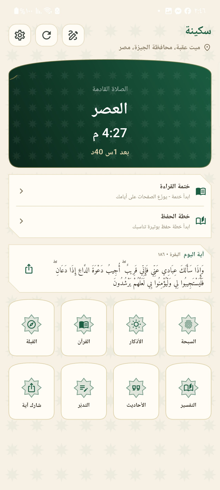
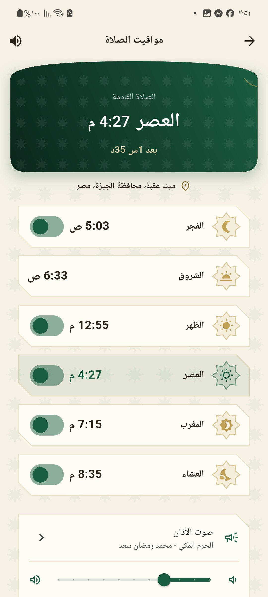
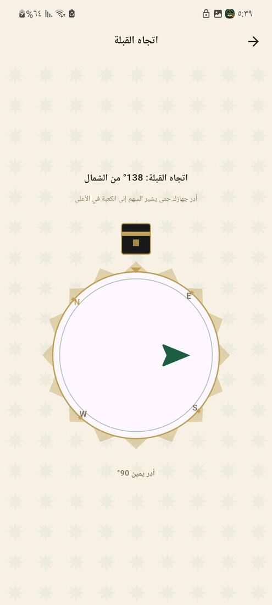
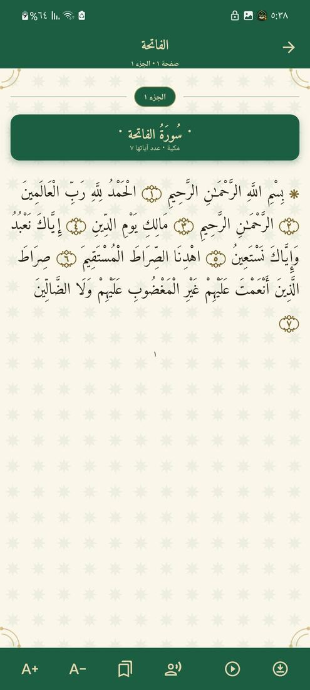
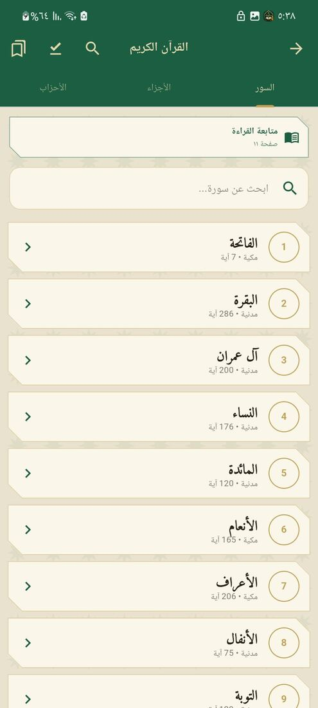
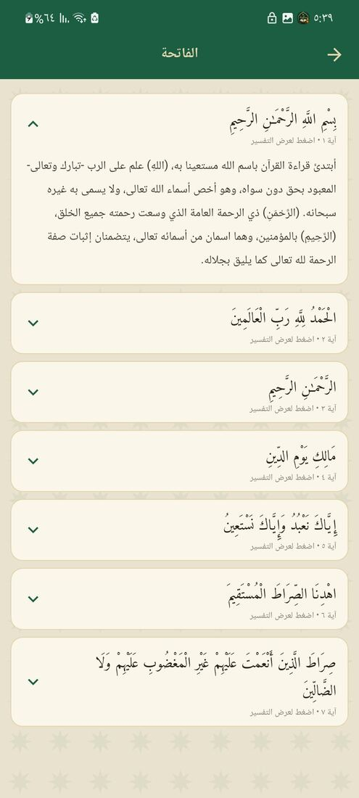
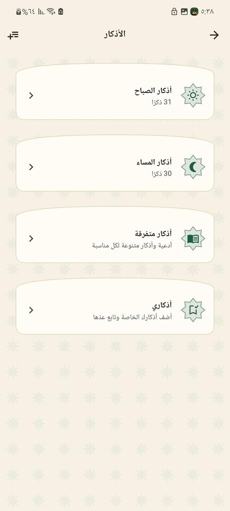
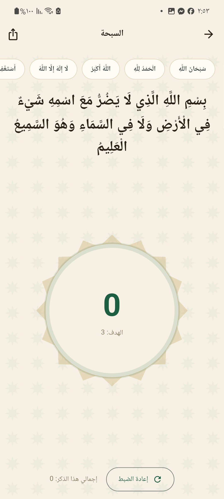

# سكينة

**تطبيق إسلامي بالعربية: مواقيت الصلاة والأذان، المصحف الشريف بالتلاوة، الأذكار، السبحة، القبلة، التفسير، والأحاديث.**

يعمل دون اتصال بعد أول تشغيل · بلا إعلانات · بلا تتبّع · مجاني

### [⬇️ حمّل آخر إصدار](https://github.com/omar95123/sakinah-releases/releases/latest)

---

## طريقة التثبيت

التطبيق ليس على متجر Play، فيُثبَّت من ملف `APK` مباشرة — وهذه خطوات مرة واحدة فقط:

1. افتح [صفحة آخر إصدار](https://github.com/omar95123/sakinah-releases/releases/latest) من هاتفك.
2. تحت عنوان **Assets** نزّل الملف الذي يبدأ بـ **`sakinah-`** وينتهي بـ **`.apk`** — وهو ملف واحد يعمل على كل هواتف أندرويد.
   (أما `Source code (zip)` و`(tar.gz)` فيضيفهما GitHub تلقائيًا ولا يحتويان على التطبيق — تجاهلهما.)
3. افتح الملف بعد التنزيل. سيسألك أندرويد عن السماح بالتثبيت من هذا المصدر — اضغط **الإعدادات** ثم فعّل **السماح من هذا المصدر**، وارجع.
4. اضغط **تثبيت**. قد تظهر رسالة من Play Protect تقول إن المطوّر غير معروف — اختر **التثبيت على أي حال**؛ هذه رسالة تظهر لأي تطبيق خارج المتجر.
5. عند أول فتح سيطلب التطبيق أذونات الإشعارات والموقع — وكلها لازمة لعمل الأذان والقبلة كما هو موضّح أدناه.

> **ملاحظة عن التحديثات:** لتحديث التطبيق لاحقًا، نزّل الإصدار الأحدث من الصفحة نفسها وثبّته فوق القديم مباشرة — بياناتك وإعداداتك وتحميلاتك تبقى كما هي.

---

## لقطات من التطبيق

| الرئيسية | مواقيت الصلاة | اتجاه القبلة |
|:---:|:---:|:---:|
|  |  |  |

| المصحف | فهرس السور | التفسير |
|:---:|:---:|:---:|
|  |  |  |

| الأذكار | أذكار الصباح | السبحة | الأحاديث |
|:---:|:---:|:---:|:---:|
|  |  |  |  |

---

## ماذا يقدّم التطبيق؟

**🕌 مواقيت الصلاة والأذان** — حساب المواقيت على جهازك من إحداثياتك مباشرة، وأذان كامل في وقت كل صلاة يعمل والتطبيق مغلق والهاتف مقفول. تسعة أصوات للاختيار منها تسجيلات تاريخية (محمد رفعت، أبو العينين شعيشع، محمد علي البنا)، وتكبير قصير لمن أراد تنبيهًا موجزًا. تفعيل أو تصميت كل صلاة على حدة، وتحكّم في مستوى الصوت.

**📖 المصحف الشريف** — ٦٠٤ صفحات بتقسيم المصحف المطبوع (رواية حفص عن عاصم) بالرسم العثماني، مع علامات الأجزاء والأحزاب والأرباع، وتلاوة بصوت عدد من القرّاء مع إمكانية تحميل السورة كاملة للاستماع دون اتصال، وتكبير الخط، ووضع ليلي.

**🧭 القبلة** — بوصلة تشير إلى الكعبة مع اهتزاز عند ضبط الاتجاه.

**📿 الأذكار والسبحة** — أذكار الصباح والمساء والنوم وغيرها، وسبحة إلكترونية بعدّادات محفوظة، مع إمكانية إضافة ذكرك الخاص.

**🌙 إضافات** — تفسير الآيات، أحاديث نبوية، وإشعار بذكر يتغيّر تلقائيًا، وودجت للشاشة الرئيسية.

---

## الخصوصية

- **لا يخرج موقعك من هاتفك.** المواقيت والقبلة تُحسب محليًا على الجهاز من الإحداثيات، ولا تُرسَل إلى أي خادم.
- **لا حسابات ولا تسجيل دخول ولا جمع بيانات.**
- **لا إعلانات ولا أدوات تتبّع.**
- الاتصال بالإنترنت يُستخدم فقط عند تنزيل التلاوات وتحديث اسم المدينة.

**الأذونات ولماذا:** الإشعارات (لتنبيه الأذان)، الموقع (لحساب المواقيت واتجاه القبلة)، الموقع في الخلفية (لإعادة حساب المواقيت إذا سافرت والتطبيق مغلق)، وتجاهل تقييد البطارية (لئلا يؤخّر النظام الأذان عن وقته).

---

تطوير **[عمر طاهر](https://eg.linkedin.com/in/omar-taher-80a94421b)**

لأي مشكلة أو اقتراح، افتح [Issue](https://github.com/omar95123/sakinah-releases/issues)

