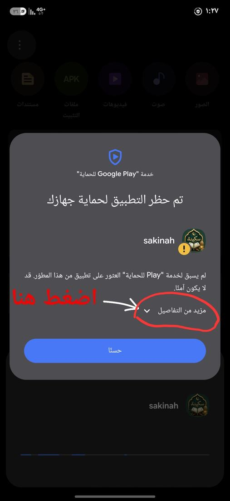
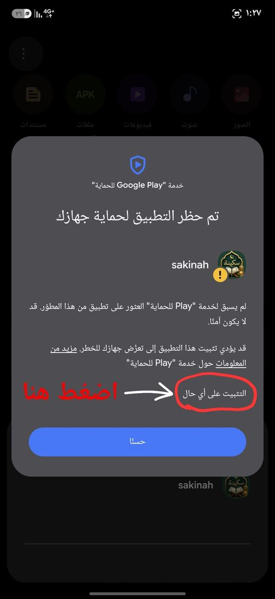
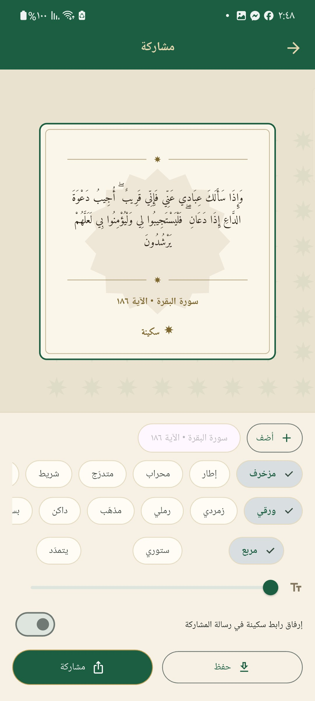
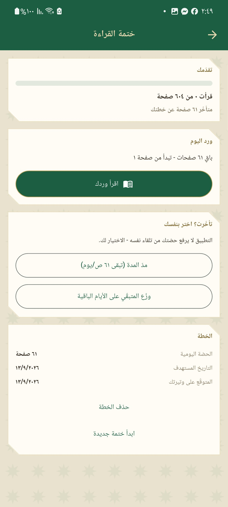
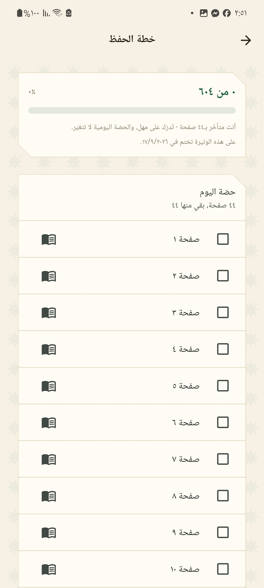
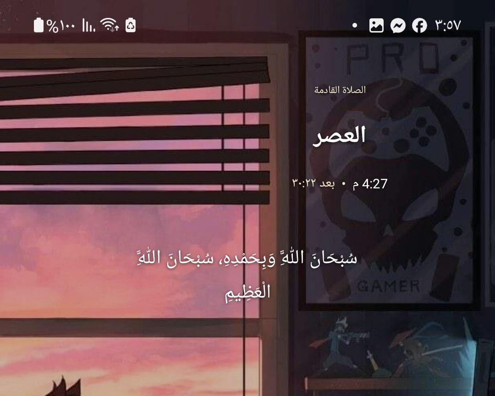

# سكينة

**تطبيق إسلامي بالعربية: مواقيت الصلاة والأذان، المصحف الشريف بالتلاوة، الأذكار، السبحة، القبلة، التفسير، والأحاديث.**

يعمل دون اتصال بعد أول تشغيل · بلا إعلانات · بلا تتبّع · مجاني

### [⬇️ حمّل آخر إصدار](https://github.com/omar95123/sakinah-releases/releases/latest)

---

## طريقة التثبيت

التطبيق ليس على متجر Play، فيُثبَّت من ملف `APK` مباشرة — وهذه خطوات مرة واحدة فقط:

1. افتح [صفحة آخر إصدار](https://github.com/omar95123/sakinah-releases/releases/latest) من هاتفك.
2. تحت عنوان **Assets** نزّل الملف الذي يبدأ بـ **`sakinah-`** وينتهي بـ **`.apk`** — وهو ملف واحد يعمل على كل هواتف أندرويد.
   (أما `Source code (zip)` و`(tar.gz)` فيضيفهما GitHub تلقائيًا ولا يحتويان على التطبيق — تجاهلهما.)
3. افتح الملف بعد التنزيل. سيسألك أندرويد عن السماح بالتثبيت من هذا المصدر — اضغط **الإعدادات** ثم فعّل **السماح من هذا المصدر**، وارجع.
4. اضغط **تثبيت**. قد تظهر شاشة زرقاء من Play Protect تقول **«تم حظر التطبيق لحماية جهازك»** — لا تضغط «حسنًا»، بل اضغط **مزيد من التفاصيل** ثم **التثبيت على أي حال** كما في الصورتين:

  
  &nbsp;&nbsp;
  

> هذه الرسالة تظهر لأي تطبيق يُثبَّت من خارج متجر Play، ومعناها أن جوجل لم تفحص التطبيق — لا أن فيه ضررًا. ومن أراد التحقق بنفسه فبصمة توقيع الإصدار منشورة في مستودع المشروع.

5. عند أول فتح سيطلب التطبيق أذونات الإشعارات والموقع — وكلها لازمة لعمل الأذان والقبلة كما هو موضّح أدناه.

> **ملاحظة عن التحديثات:** لتحديث التطبيق لاحقًا، نزّل الإصدار الأحدث من الصفحة نفسها وثبّته فوق القديم مباشرة — بياناتك وإعداداتك وتحميلاتك تبقى كما هي.

---

## لقطات من التطبيق

| الرئيسية | مواقيت الصلاة | اتجاه القبلة |
|:---:|:---:|:---:|
|  |  |  |

| المصحف | فهرس السور | التفسير |
|:---:|:---:|:---:|
|  |  |  |

| كارت المشاركة | ختمة القراءة | خطة الحفظ |
|:---:|:---:|:---:|
|  |  |  |

| الأذكار | أذكار الصباح | السبحة | الأحاديث |
|:---:|:---:|:---:|:---:|
|  |  |  |  |

**ودجت الشاشة الرئيسية** — الصلاة القادمة بعدّاد حيّ للوقت المتبقي، وذكر قصير يتبدّل كل خمس دقائق. الاثنان بلا خلفية ولون نصّهما يتبع خلفيتك، وحجمهما قابل للتغيير.

  

---

## ماذا يقدّم التطبيق؟

**🕌 مواقيت الصلاة والأذان** — حساب المواقيت على جهازك من إحداثياتك مباشرة، وأذان كامل في وقت كل صلاة يعمل والتطبيق مغلق والهاتف مقفول. تسعة أصوات للاختيار منها تسجيلات تاريخية (محمد رفعت، أبو العينين شعيشع، محمد علي البنا)، وتكبير قصير لمن أراد تنبيهًا موجزًا. تفعيل أو تصميت كل صلاة على حدة، وتحكّم في مستوى الصوت.

**📖 المصحف الشريف** — ٦٠٤ صفحات بتقسيم المصحف المطبوع (رواية حفص عن عاصم) بالرسم العثماني، مع علامات الأجزاء والأحزاب والأرباع، وتلاوة بصوت عدد من القرّاء مع إمكانية تحميل السورة كاملة للاستماع دون اتصال، وتكبير الخط، ووضع ليلي.

**🧭 القبلة** — بوصلة تشير إلى الكعبة مع اهتزاز عند ضبط الاتجاه.

**📿 الأذكار والسبحة** — أذكار الصباح والمساء والنوم وغيرها، وسبحة إلكترونية بعدّادات محفوظة تضمّ أكثر من أربعين ذكرًا، مع إمكانية إضافة ذكرك الخاص.

**📅 ختمة القراءة وخطة الحفظ** — خطتان منفصلتان: واحدة لختم القراءة وأخرى للحفظ والمراجعة. تختار المدة أو التاريخ المستهدف، فيوزّع التطبيق الصفحات على أيامك ويتابع تقدّمك وسلسلة أيامك. وصفحات القراءة تُسجَّل من نفسها وأنت تقرأ في المصحف، بلا زر توقّع عليه كل صفحة. وإن تأخّرت فالاختيار لك: تمدّ المدة أو توزّع المتبقّي — التطبيق لا يرفع حصّتك من تلقاء نفسه.

**🖼️ كروت المشاركة** — تحوّل أي آية أو حديث أو ذكر إلى صورة جاهزة للمشاركة: ستة عشر شكلًا وستة ألوان، ومقاس مربع أو ستوري أو يتمدّد مع النص. وتقدر تجمع أكثر من مقطع في كارت واحد (آية وتعليق منك مثلًا)، أو تكتب كارتك من عندك.

**📝 دفتر التدبّر** — تقيّد خاطرتك عند الآية التي وقفت عندها، بوسوم تجمعها وتعود إليها.

**🌙 إضافات** — تفسير الآيات، أحاديث نبوية، مؤقّت نوم يوقف التلاوة بعد مدة تختارها أو عند نهاية السورة، وإشعار بذكر يتغيّر تلقائيًا، وودجتان للشاشة الرئيسية.

---

## الخصوصية

- **لا يخرج موقعك من هاتفك.** المواقيت والقبلة تُحسب محليًا على الجهاز من الإحداثيات، ولا تُرسَل إلى أي خادم.
- **لا حسابات ولا تسجيل دخول ولا جمع بيانات.**
- **لا إعلانات ولا أدوات تتبّع.**
- الاتصال بالإنترنت يُستخدم فقط عند تنزيل التلاوات وتحديث اسم المدينة.

**الأذونات ولماذا:** الإشعارات (لتنبيه الأذان)، الموقع (لحساب المواقيت واتجاه القبلة)، الموقع في الخلفية (لإعادة حساب المواقيت إذا سافرت والتطبيق مغلق)، وتجاهل تقييد البطارية (لئلا يؤخّر النظام الأذان عن وقته).

---

تطوير **[عمر طاهر](https://eg.linkedin.com/in/omar-taher-80a94421b)**

لأي مشكلة أو اقتراح، افتح [Issue](https://github.com/omar95123/sakinah-releases/issues)

